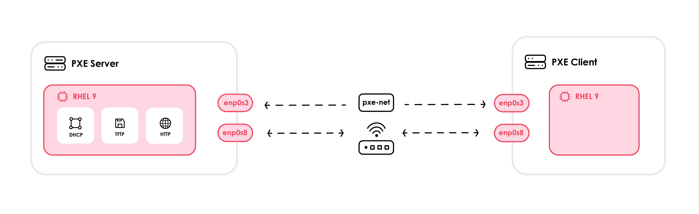

# PXE-Booting Stig-Hardened RHEL 9 - Lab

In this lab we will PXE-boot a Stig-Hardened RHEL 9 OS between two VMs using Vagrant (VirtualBox), with DHCP/TFTP/HTTP and Kickstart automation.

## Topology



This lab uses two VMs provisioned via vagrant:

- The **PXE Server VM** — runs **DHCP**, **TFTP**, and **HTTP** on the PXE segment (e.g., VirtualBox _Internal Network_ `pxe-net`). It also has a second NIC (NAT/Bridged) for Internet access and updates.

- The **PXE Client VM** — has a NIC on the same PXE segment (PXE/net first in boot order). It also has a second NIC (NAT/Bridged) for Internet access after installation.

**Routing behavior:**  
We do **not** advertise a default gateway on the PXE subnet (`option routers` is commented). The client keeps its **default route** on the other NIC (NAT/Bridged), so Internet works during/after install.

**Boot flow in brief:**

1. The client boots and broadcasts **DHCP** on the PXE NIC.
2. The server assigns an IP and tells the client where to get the bootloader via **`next-server`** and **`filename`**:
   - BIOS → `pxelinux.0` (Syslinux)
   - UEFI → `redhat/EFI/BOOT/BOOTX64.EFI`
3. The client pulls the boot menu and the installer’s **`vmlinuz`** (kernel) and **`initrd.img`** (initial ramdisk) via **TFTP**.
4. The kernel boots, networking comes up, and **Anaconda** fetches the installation tree and **Kickstart** over **HTTP** from the PXE server.

**Why isolate the PXE network?**  
It prevents accidental DHCP conflicts on your LAN and limits the blast radius of any misconfiguration while you iterate.

## Build the RHEL Vagrant box with Packer

I used **Packer (VirtualBox)** to turn the RHEL ISO + a Kickstart file into a reusable Vagrant box. The Kickstart file was taken from a manual install of RHEL 9 I did on a Raspberry Pi.

### To use the Kickstart file you need to first fill in the placeholders.

> Note: these placeholders are for the root and admin users' passwords

1. To Fill in `<ROOT_PASSWORD_HASH>` and `<ADMIN_PASSWORD_HASH>` generate a SHA-512 hash:

You'll be prompted to type the password; paste the output into the KS file

```bash
openssl passwd -6
```

Paste it in your Kickstart file where it says `<ROOT_PASSWORD_HASH>` and `<ADMIN_PASSWORD_HASH>` (for each user seperately)

```bash
rootpw --iscrypted <ROOT_PASSWORD_HASH>
user --name=admin --groups=wheel --password=<ADMIN_PASSWORD_HASH>  --iscrypted
```

### To use the rhel9-stig.pkr.hcl file you need to first fill in the placeholders.

1. `<ISO_URL>` — Is where the installer ISO is located, so use a `file://` URL to point to your RHEL ISO.

- **Windows example:**  
  `iso_url = "file:///C:/Users/you/Downloads/rhel-9.6-x86_64-dvd.iso"`
- **Linux/macOS example:**  
  `iso_url = "file:///home/you/isos/rhel-9.6-x86_64-dvd.iso"`

2. `<ISO_SHA256>` — Is the checksum of the ISO (with algorithm prefix). Compute the SHA-256 of your ISO, then paste it as `sha256:<hash>`.

To get the checksum on Linux:

```bash
sha256sum /path/to/rhel-9.6-x86_64-dvd.iso
```

3. `<HTTP_DIRECTORY>` - Point this to a local directory that contains your Kickstart file

- **Windows example:**  
  `http_directory = "C:/Users/you/labs/pxe_lab/packer/http"`
- **Linux/macOS example:**  
  `http_directory = "/home/you/pxe_lab/packer/http"`

### To create the vagrant box using Packer run these commands in the same directory as the `rhel9-stig.pkr.hcl` file:

```bash
packer init .
packer validate .
packer build .
```

> This process is still a WIP and does not run all the way through. When the VM comes up, after it's finished intsalling, you will need to ssh in and reboot it in order for it to finish creating the Vagrant box. You would run the following commands:

```bash
sudo shutdown -P now
```

## Create the VMs with Vagrant (quick notes)

**Fill placeholders (if present):**

- `<BOX_NAME>` — the name for your base box, e.g., `user/rhel9-stig` or a local box you added.
- `<BOX_URL>` — (e.g., `file:///C:/path/to/rhel9-stig-pxebox.box`)
- `<PXE_SERVER_IP>` — the server’s IP on the PXE network (e.g., `192.168.20.2`).
- `<BRIDGE_ADAPTER>` — your NIC name if you enable bridged mode. Find it with:

```bash
VBoxManage list bridgedifs
```

> **Prereqs:** Install VirtualBox and Vagrant.

To create a VM via Vagrant run the following command in the same directory as the Vagrantfile:

```bash
vagrant up
```

Other Useful Commands:

```bash
vagrant ssh                  # shell into the VM
vagrant halt                 # stop a VM
vagrant reload               # Reloads the VM
vagrant destroy --force      # Deletes the VM
```

---

# PXE-Boot Process

Use Vagrant to create the first VM to serve as the PXE Server

> **Note:** You should run these commands as the root user

> **Note:** If you don't already, might be a good idea to install VIM: `dnf install -y vim`

## Install & enable Apache (HTTP)

This step installs and starts Apache so the PXE clients can fetch the RHEL installation tree and your Kickstart file over HTTP. It also opens port 80 in the firewall and enables the service to start automatically on boot, ensuring the content remains reachable during installs.

```bash
dnf install -y httpd
systemctl enable --now httpd
firewall-cmd --permanent --add-service=http
firewall-cmd --reload
systemctl status httpd
```

## Install & configure DHCP (for PXE)

This step installs and configures a DHCP server that assigns IP addresses on the PXE network and tells clients where to fetch the bootloader. It sets next-server and filename so BIOS and UEFI machines download pxelinux.0 or BOOTX64.EFI and begin the network installation. (In our case we configure things for a BIOS machine)

```bash
dnf install -y dhcp-server
vim /etc/dhcp/dhcpd.conf
```

Enter the following configuration in the `/etc/dhcp/dhcpd.conf` file. Replace the addresses to match your network card.

> **Note:** Why `option routers` is commented out? We have commented out `option routers` to prevent a conflict with the client's internet connection. When this option is enabled, the default gateway assigned by the PXE server can interfere with the internet access of the other (non-PXE) nic for the client. Leaving it out ensures a stable internet connection.

```conf
#
# DHCP Server Configuration file.
#   see /usr/share/doc/dhcp-server/dhcpd.conf.example
#   see dhcpd.conf(5) man page
#
option architecture-type code 93 = unsigned integer 16;

subnet 192.168.20.0 netmask 255.255.255.0 {
#  option routers 192.168.20.2;
  option domain-name-servers 192.168.20.2;
  range 192.168.20.100 192.168.20.200;
  class "pxeclients" {
    match if substring (option vendor-class-identifier, 0, 9) = "PXEClient";
    next-server 192.168.20.2;
          if option architecture-type = 00:07 {
            filename "redhat/EFI/BOOT/BOOTX64.EFI";
          }
          else {
            filename "pxelinux/pxelinux.0";
          }
  }
  class "httpclients" {
    match if substring (option vendor-class-identifier, 0, 10) = "HTTPClient";
    option vendor-class-identifier "HTTPClient";
    filename "http://192.168.20.2/redhat/EFI/BOOT/BOOTX64.EFI";
  }
}
```

Enable DHCP and check the status

```bash
systemctl enable --now dhcpd
systemctl status dhcpd
```

## Install and Enable TFTP

This step installs the TFTP server and enables the socket-activated service (tftp.socket) so PXE clients can download the bootloader and installer files (e.g., pxelinux.0, vmlinuz, initrd.img) over UDP port 69.

```bash
dnf install -y tftp-server
firewall-cmd --add-service=tftp --permanent
firewall-cmd --reload
systemctl enable --now tftp.socket
```

## Perpare the directories

```bash
mkdir -p /opt/isos
mkdir -p /opt/pxe-files
mkdir -p /mnt/rhel9-iso
```

## Upload the ISO and the Kickstart file to the PXE Server

You can download the RHEL 9 ISO from https://developers.redhat.com/products/rhel/download#rhelforsap896

In order to rsync the files to directories that the admin user doesn't have permission to access, you will have to loosen the stig to allow ssh as the root user.

```bash
vim /etc/ssh/sshd_config
```

In `sshd_config` change `PermitRootLogin` and `PasswordAuthentication` to the following below:

```config
PermitRootLogin yes
PasswordAuthentication yes
```

Update the `0-complianceascode-hardening.conf` file

```bash
vim /etc/ssh/sshd_config.d/00-complianceascode-hardening.conf
```

In the `0-complianceascode-hardening.conf` file change `PermitRootLogin` to the following below:

```config
PermitRootLogin yes
```

Then run:

```bash
systemctl restart sshd
```

If you accidentally fail to enter the root passwword too many times you can run this command to reset the failed attempts (You'll have to use admin to login):

```bash
faillock --user root --reset
```

> **Note** – Why rsync? The reason we want to use rsync for transferring the ISO is because the RHEL 9 ISO is pretty hefty, sitting at around ~12 GB. `rsync -avP` is reliable for large files because it resumes interrupted transfers and only re-sends missing chunks over SSH. If the network goes out or the transfer times out you can pick right up where you left off.

Install rsync:

```bash
sudo dnf install -y rsync
```

Use rsync to send the ISO and the Kickstart file to the PXE Server

```bash
rsync -avzP rhel-9.6-x86_64-dvd.iso root@<PXE_SERVER_IP>:/opt/isos/
rsync -avzP ssg-rhel9-stig-ks.cfg root@<PXE_SERVER_IP>:/root/
```

## Mount the ISO

```bash
mount -t iso9660 /opt/isos/rhel-9.6-x86_64-dvd.iso /mnt/rhel9-iso -o loop
```

## Install the PXE bootloader files (pxelinux/syslinux)

Extract syslinux-tftpboot RPM contents to populate TFTP boot files:

```bash
mkdir -p /opt/pxe-files/rhel9/
cp -pr /mnt/rhel9-iso/AppStream/Packages/syslinux-tftpboot-6.04-0.20.el9.noarch.rpm /opt/pxe-files/rhel9/
cd /opt/pxe-files/rhel9/
rpm2cpio syslinux-tftpboot-6.04-0.20.el9.noarch.rpm | cpio -dimv
```

Create TFTP tree and copy:

```bash
mkdir /var/lib/tftpboot/pxelinux
cp /opt/pxe-files/rhel9/tftpboot/* /var/lib/tftpboot/pxelinux
mkdir /var/lib/tftpboot/pxelinux/pxelinux.cfg
```

## PXE menu (BIOS) – pxelinux.cfg/default

This step creates the BIOS PXE boot menu that pxelinux presents to clients. The default entry loads the installer’s kernel and initrd from TFTP and passes kernel arguments so Anaconda knows where to fetch the installation tree and your Kickstart over HTTP.

> **Note** `Anaconda` is Red Hat’s installer program for RHEL (and Fedora). It boots the kernel and initrd, brings up networking and storage, and then installs the OS according to your choices—or automatically via a Kickstart file.

Create a configuration file named default and add it to the pxelinux.cfg/ directory as shown in the following example

```bash
vim /var/lib/tftpboot/pxelinux/pxelinux.cfg/default
```

Add the following:

```cfg
default vesamenu.c32
prompt 1
timeout 600

display boot.msg

label linux
  menu label ^Install RHEL 9
  menu default
  kernel images/RHEL-9/vmlinuz
  append initrd=images/RHEL-9/initrd.img ip=dhcp inst.repo=http://192.168.20.2/rhel9/ inst.ks=http://192.168.20.2/rhel-9-ks.cfg
label vesa
  menu label Install system with ^basic video driver
  kernel images/RHEL-9/vmlinuz
  append initrd=images/RHEL-9/initrd.img ip=dhcp inst.xdriver=vesa nomodeset inst.repo=http://192.168.20.2/rhel9/
label rescue
  menu label ^Rescue installed system
  kernel images/RHEL-9/vmlinuz
  append initrd=images/RHEL-9/initrd.img inst.rescue
  inst.repo=http://192.168.20.2/rhel9/
label local
  menu label Boot from ^local drive
  localboot 0xffff
```

### Breif notes on some of the feilds

`inst.repo` – Tells the installer the HTTP location of the RHEL install tree (your ISO bind-mount).

`inst.ks` – Points to your Kickstart for unattended installation.

`ip=dhcp` / `rd.neednet=1` – Brings up networking via DHCP and ensures the network is available during early boot.

`inst.text` / `inst.debug` / `rd.shell` – Enables the text-mode installer, extra logging, and an emergency shell for troubleshooting

## Copy `vmlinuz` and `initrd.img` to the TFTP server

This step copies the installer’s kernel (vmlinuz) and initial RAM disk (initrd.img) from the mounted ISO into the TFTP path so PXE clients can download them and start Anaconda. Ensure the destination path matches the kernel and initrd entries used in your pxelinux.cfg/default

### What are vmlinuz and initrd.img?

`vmlinuz` – The compressed Linux kernel the installer boots
`initrd.img` – The initial RAM disk; a tiny root filesystem with drivers and tools needed before the real system exists

```bash
mkdir -p /var/lib/tftpboot/pxelinux/images/RHEL-9/
```

```bash
cp /mnt/rhel9-iso/images/pxeboot/{vmlinuz,initrd.img} /var/lib/tftpboot/pxelinux/images/RHEL-9/
```

## Create the web root & bind mount via fstab:

This step makes the ISO’s installation tree available over HTTP by adding two entries to `/etc/fstab`: one to loop-mount the ISO read-only at `/mnt/rhel9-iso`, and another to bind-mount that path into Apache’s docroot at `/var/www/html/rhel9` so it persists across reboots.

> **Note:** We use a bind mount instead of copying the ISO’s installation tree into `/var/www/html/` because the directory didn’t have enough free space; mounting exposes the ISO contents without duplicating ~12 GB and finishes much faster.

```bash
mkdir -p /var/www/html/rhel9
vim /etc/fstab
```

Add the following lines to fstab

```bash
/opt/isos/rhel-9.6-x86_64-dvd.iso  /mnt/rhel9-iso  iso9660  loop,ro  0 0
/mnt/rhel9-iso  /var/www/html/rhel9     none    bind    0 0
```

Then Apply the changes

```bash
mount -a
systemctl daemon-reload
```

## Set permissions for TFTP tree

This step applies safe, consistent permissions to the TFTP tree so the server can read and serve file.

> **Note:** If directories lack the execute bit or files aren’t world-readable, PXE clients fail with TFTP timeouts or “Access violation / File not found” (e.g., PXE-E32).

```bash
find /var/lib/tftpboot -type d -exec chmod 755 {} \;
find /var/lib/tftpboot -type f -exec chmod 644 {} \;
```

## Place the Kickstart file

This step publishes your Kickstart file under Apache so PXE clients can fetch it.

> **Consequences of incorrect Kickstart perms:** If the file isn’t world-readable (`644`) or has the wrong SELinux label, Apache returns `403 Forbidden` and Anaconda fails to fetch the kickstart file, dropping to interactive install or aborting with “failed to load kickstart.”

```bash
cd /root/
sudo chown root:root ssg-rhel9-stig-ks.cfg
mv /root/ssg-rhel9-stig-ks.cfg /var/www/html/rhel-9-ks.cfg
restorecon -v /var/www/html/rhel-9-ks.cfg
chmod 644 /var/www/html/rhel-9-ks.cfg
systemctl restart httpd
```

## Adding UEFI PXE Boot (GRUB2) Option

UEFI clients don’t use `pxelinux.0`; they load a UEFI bootloader (`BOOTX64.EFI`) which then reads a **GRUB config**. Here’s the minimal setup to serve that from TFTP.

Follow these steps to enable PXE booting with UEFI firmware

Put the UEFI bootloader on TFTP

```bash
mkdir /var/lib/tftpboot/redhat
cp -r /mnt/rhel9-iso/EFI /var/lib/tftpboot/redhat/
chmod -R 755 /var/lib/tftpboot/redhat/
```

Add a menu entry to the grub.cfg file

```bash
set timeout=60
menuentry 'RHEL 9' {
  linuxefi /pxelinux/images/RHEL-9/vmlinuz ip=dhcp inst.ks=http://<PXE_SERVER_IP>/rhel9-ks.cfg inst.repo=http://<PXE_SERVER_IP>/rhel9/
  initrdefi /pxelinux/images/RHEL-9/initrd.img
}
```

Ensure TFTP is running

```bash
systemctl enable --now tftp.socket
```

## Creating the PXE Client (BIOS PXE boot)

> You can find the Vagrantfile for the PXE Client in the Vagrnat directory

You can now use Vagrant to create the second VM to serve as the PXE Client

1. When you first PXE-Boot the client, have boot1 set to `net` and boot2 set to `disk`

```bash
"--boot1", "net",
"--boot2", "disk",
```

2. When it is finished and it reboots, use `vagrant halt` to stop the VM and switch the boot order so it now boots from disk

```bash
"--boot1", "disk",
"--boot2", "net",
```

## Booting via UEFI

> If you decide to boot via UEFI make sure the vagrant file includes `"--firmware", "efi",`

> As of VirtualBox 7.1, EFI booting is broken and PXE boot with EFI will not work correctly. To run this project with EFI enabled, you must use VirtualBox 7.0 instead.

1. When you start the PXE Client VM via the `vagrant up` command close the dialog that pops up


2. Press `Esc` a couple times to enter the BIOS


3. Once your in the BIOS select `Boot Manager`


4. Then select one of the UEFI PXEv4 options (select the one that corresponds to the PXE NIC)

Then you're done :)
